# 👋 Hello, I'm **Prohor Banik**

<div align="center">
  
</div>

<div align="center">
  
  
  [](https://www.linkedin.com/in/proholladbanik)
  [](mailto:prohollad.banik@gmail.com)
  
</div>

---

## 🚀 About Me


```javascript
const prohor = {
    location: "Bangladesh 🇧🇩",
    currentFocus: ["MERN Stack", "Laravel", "Next.js"],
    passion: "Building innovative web solutions",
    funFact: "I bring humor to code reviews! 😄",
    philosophy: "Clean code is not written by following a set of rules. 
                 Clean code is written by a programmer who cares.",
    availability: "Always open to interesting projects"
};
```

### 🎯 Current Focus
- 🔭 Crafting full-stack applications with **MERN Stack**
- 🌱 Mastering **Laravel** for robust backend solutions  
- ⚡ Building fast, SEO-friendly apps with **Next.js**
- 🎨 Creating pixel-perfect, responsive user interfaces

---

## 🛠️ Tech Arsenal

<div align="center">

### 🎨 Frontend


### ⚙️ Backend


### 🗄️ Databases


### 🔧 Tools & Platforms


</div>

---

## 📊 GitHub Analytics

<div align="center">
  
  
</div>

<div align="center">
  
</div>

---

## 🎯 What I'm Up To

```mermaid
graph TD
    A[🎯 Current Goals] --> B[Master Full-Stack Development]
    A --> C[Build Scalable Applications]
    A --> D[Contribute to Open Source]
    
    B --> E[MERN Stack Mastery]
    B --> F[Laravel Expertise]
    B --> G[Next.js Proficiency]
    
    C --> H[Performance Optimization]
    C --> I[Best Practices]
    
    D --> J[Community Impact]
    D --> K[Knowledge Sharing]
```



---

## 💫 Fun Zone

<div align="center">
  
  **💡 Developer Joke of the Day:**
  
  *"Why do programmers prefer dark mode? Because light attracts bugs!"* 🐛
  
  **🎮 When I'm not coding:** Gaming • Exploring new tech • Coffee enthusiast ☕
  
</div>

---

## 🤝 Let's Connect & Collaborate

<div align="center">

**Open to exciting opportunities and collaborations!**

[](https://www.linkedin.com/in/proholladbanik)
[](mailto:prohollad.banik@gmail.com)

</div>

---

<div align="center">
  
</div>

⭐ **If you find my work interesting, give it a star!**
